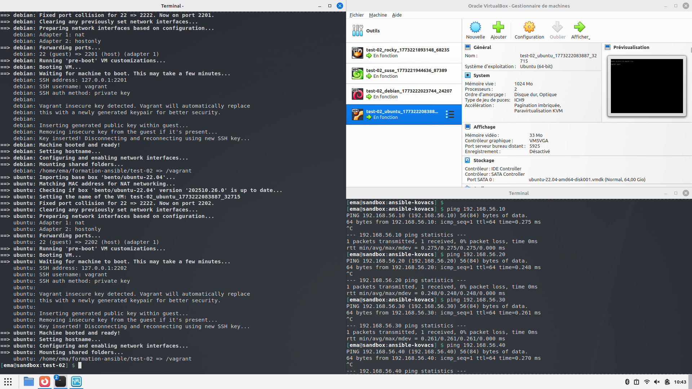

# Introduction 

## Test 01

Voici la capture d'écran après avoir lancé la commande vagrant pour le test-01 :

## Test 02

Voici la capture d'écran après avoir lancé la commande vagrant pour le test-02 :

