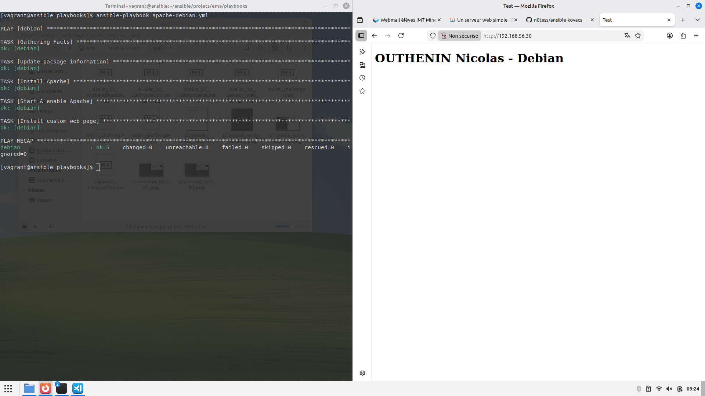
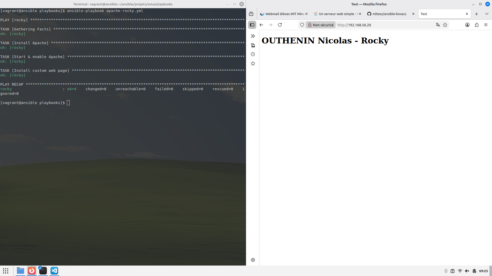
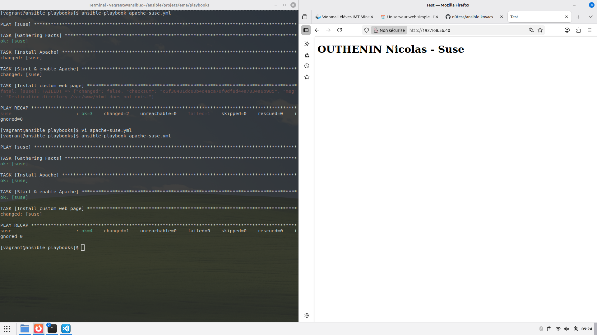

## Un simple serveur Web

### Étape 1

Test de la connectivité aux cibles :

```console
$ ansible testing -m ping

rocky | SUCCESS => {
    "changed": false,
    "ping": "pong"
}
suse | SUCCESS => {
    "changed": false,
    "ping": "pong"
}
debian | SUCCESS => {
    "changed": false,
    "ping": "pong"
}
```

### Étape 2 - Écriture du premier playbook  

Création du playbook `apache-debian.yml` dans `ansible/projects/ema/playbooks`

Voici le playbook `apache-debian.yml` :

```yaml
---  # apache-debian.yml

- hosts: debian

  tasks:
    - name: Update package information
      apt:
        update_cache: true
        cache_valid_time: 3600

    - name: Install Apache
      apt:
        name: apache2

    - name: Start & enable Apache
      service:
        name: apache2
        state: started
        enabled: true

    - name: Install custom web page
      copy:
        dest: /var/www/html/index.html
        mode: 0644
        content: |
          <!doctype html>
          <html>
            <head>
              <meta charset="utf-8">
              <title>Test</title>
            </head>
            <body>
              <h1>OUTHENIN Nicolas - Debian</h1>
            </body>
          </html>

...
```

Lancement du playbook avec `ansible-playbook apache-debian.yml` : 



### Étape 3 - Écriture du deuxième playbook  

Création du playbook `apache-rocky.yml` dans `ansible/projects/ema/playbooks`

Voici le playbook `apache-rocky.yml` :

```yaml
---  # apache-rocky.yml

- hosts: rocky

  tasks:
    - name: Install Apache
      dnf:
        name: httpd

    - name: Start & enable Apache
      service:
        name: httpd
        state: started
        enabled: true

    - name: Install custom web page
      copy:
        dest: /var/www/html/index.html
        mode: 0644
        content: |
          <!doctype html>
          <html>
            <head>
              <meta charset="utf-8">
              <title>Test</title>
            </head>
            <body>
              <h1>OUTHENIN Nicolas - Rocky</h1>
            </body>
          </html>

... 
```

Lancement du playbook avec `ansible-playbook apache-rocky.yml` : 



### Étape 4 - Écriture du troisième playbook  

Création du playbook `apache-suse.yml` dans `ansible/projects/ema/playbooks`

Voici le playbook `apache-suse.yml` :

```yaml
---  # apache-suse.yml

- hosts: suse

  tasks:
    - name: Install Apache
      zypper:
        name: apache2

    - name: Start & enable Apache
      service:
        name: apache2
        state: started
        enabled: true

    - name: Install custom web page
      copy:
        dest: /srv/www/htdocs/index.html
        mode: 0644
        content: |
          <!doctype html>
          <html>
            <head>
              <meta charset="utf-8">
              <title>Test</title>
            </head>
            <body>
              <h1>OUTHENIN Nicolas - Suse</h1>
            </body>
          </html>

...
```

Lancement du playbook avec `ansible-playbook apache-suse.yml` : 

