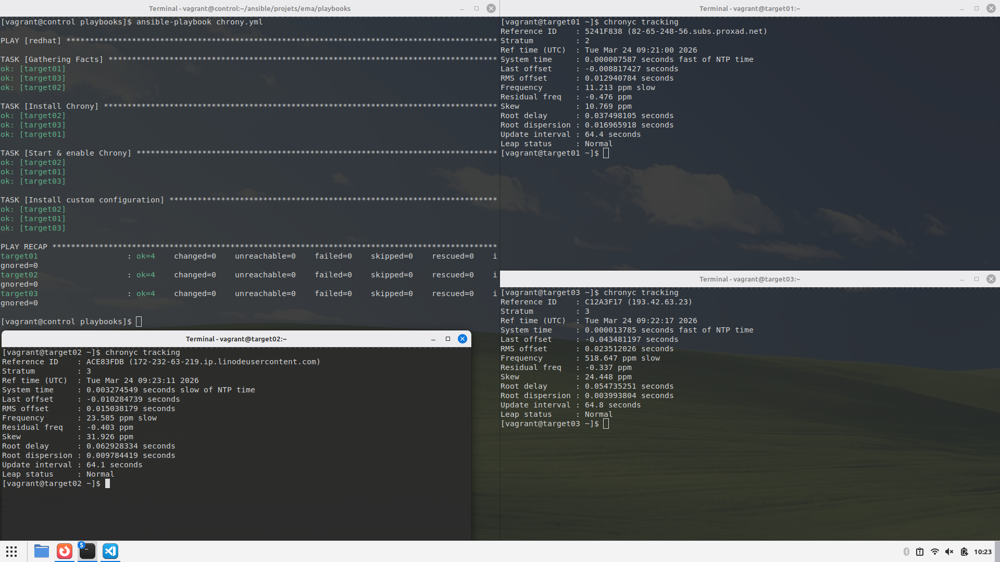

## Les Handlers

### Étape 1

Test de la connectivité aux cibles :

```
$ ansible redhat -m ping

target03 | SUCCESS => {
    "changed": false,
    "ping": "pong"
}
target01 | SUCCESS => {
    "changed": false,
    "ping": "pong"
}
target02 | SUCCESS => {
    "changed": false,
    "ping": "pong"
}
```

### Étape 2

Écriture de playbook `chrony.yml` : 

```yaml
---  # chrony.yml

- hosts: redhat

  tasks:
    - name: Install Chrony
      yum:
        name: chrony

    - name: Start & enable Chrony
      service:
        name: chronyd
        state: started
        enabled: true

    - name: Install custom configuration
      copy:
        dest: /etc/chrony.conf
        mode: 0644
        content: |
          server 0.fr.pool.ntp.org iburst
          server 1.fr.pool.ntp.org iburst
          server 2.fr.pool.ntp.org iburst
          server 3.fr.pool.ntp.org iburst
          driftfile /var/lib/chrony/drift
          makestep 1.0 3
          rtcsync
          logdir /var/log/chrony
      notify: Reload the configuration

  handlers: 
    - name: Reload the configuration    
      service:
        name: chronyd
        state: restarted
  
...
```

Voici le résultat : 


