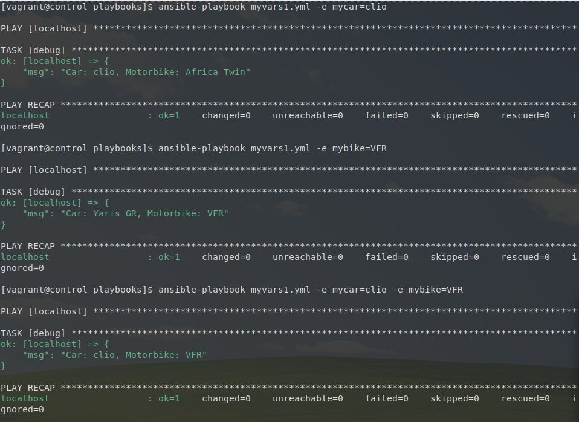
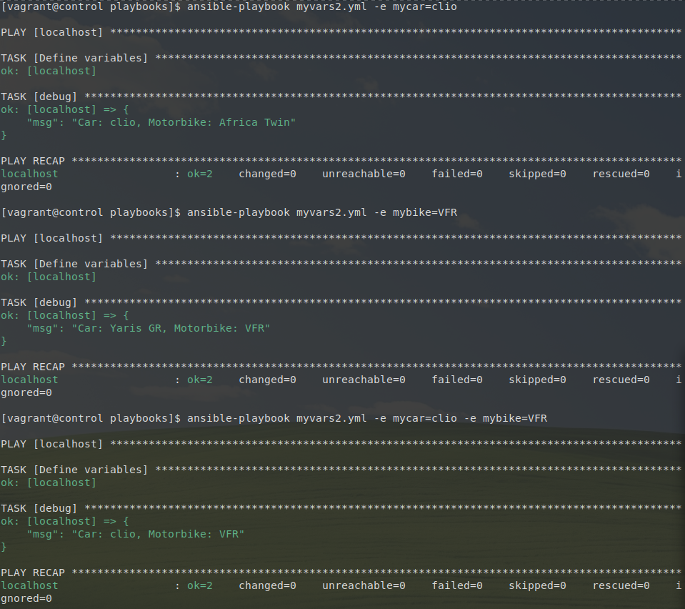
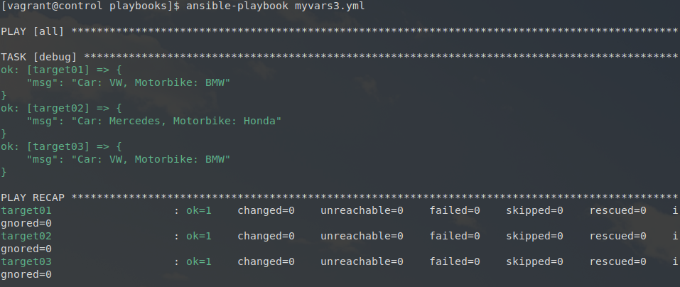

## Les variables

### Étape 1

Écriture du playbook `myvars1.yml` en utilisant les *plays vars* :

```yaml
---  # myvars1.yml

- hosts: localhost 
  gather_facts: false
  
  vars: 
    mycar: Yaris GR
    mybike: Africa Twin 

  tasks:
    - debug:
        msg: "Car: {{mycar}}, Motorbike: {{mybike}}"

...
```

Affiche : 

```console
$ ansible-playbook myvars1.yml 

PLAY [localhost] *****************************************************************************************

TASK [debug] *********************************************************************************************
ok: [localhost] => {
    "msg": "Car: Yaris GR, Motorbike: Africa Twin"
}

PLAY RECAP ***********************************************************************************************
localhost                  : ok=1    changed=0    unreachable=0    failed=0    skipped=0    rescued=0    ignored=0   
```


### Étape 2 

En utilisant les *extras vars* : 

```console
$ ansible-playbook myvars1.yml -e mycar=clio

puis

$ ansible-playbook myvars1.yml -e mybike=VFR

puis 

$ ansible-playbook myvars1.yml -e mycar=clio -e mybike=VFR
```

Retourne : 



### Étape 3

Écriture du playbook `myvars2.yml` avec `set_fact`: 

```yaml
---  # myvars2.yml

- hosts: localhost 
  gather_facts: false
  
  tasks:
    - name: Define variables
      set_fact:
        mycar: Yaris GR
        mybike: Africa Twin

    - debug:
        msg: "Car: {{mycar}}, Motorbike: {{mybike}}"

...
```

Affiche : 

```console
$ ansible-playbook myvars2.yml 

PLAY [localhost] *****************************************************************************************

TASK [Define variables] **********************************************************************************
ok: [localhost]

TASK [debug] *********************************************************************************************
ok: [localhost] => {
    "msg": "Car: Yaris GR, Motorbike: Africa Twin"
}

PLAY RECAP ***********************************************************************************************
localhost                  : ok=2    changed=0    unreachable=0    failed=0    skipped=0    rescued=0    ignored=0   
```

### Étape 4

En utilisant les *extras vars* pour la playbook `myvars2.yml` : 

```console
$ ansible-playbook myvars2.yml -e mycar=clio

puis

$ ansible-playbook myvars2.yml -e mybike=VFR

puis 

$ ansible-playbook myvars2.yml -e mycar=clio -e mybike=VFR
```

Retourne : 



### Étape 5

Écriture du playbook `myvars3.yml` :

```yaml
---  # myvars3.yml

- hosts: localhost 
  gather_facts: false
  
  tasks:
    - debug:
        msg: "Car: {{mycar}}, Motorbike: {{mybike}}"

...
```

Création du dossier `group_vars` : 

```console
$ mkdir -v ~/ansible/projets/ema/group_vars
``` 

Création du fichier `all.yml` dans `ansible/projects/ema/groupvars` :

```bash
---  # group_vars/all.yml

mycar: VW
mybike: BMW 

...
```

Le playbook affiche bien les variables définies dans `all.yml` :

```console
$ ansible-playbook myvars3.yml 

PLAY [localhost] *****************************************************************************************

TASK [debug] *********************************************************************************************
ok: [localhost] => {
    "msg": "Car: VW, Motorbike: BMW"
}

PLAY RECAP ***********************************************************************************************
localhost                  : ok=1    changed=0    unreachable=0    failed=0    skipped=0    rescued=0    ignored=0   
```

### Étape 6

Remplacement des variables par Mercedes et Honda sur l'hôte `target02` en utilisant le fichier `host_vars` : 

Création du dossier `host_vars` : 

```console
$ mkdir -v ~/ansible/projets/ema/host_vars
```

Création du fichier `target02.yml` :

```yaml
---  # host_vars/target02.yml

mycar: Mercedes
mybike: Honda

...
```

Modification du playbook `myvars3.yml` : 

```yaml
---  # myvars3.yml

- hosts: all 
  gather_facts: false
  
  tasks:
    - debug:
        msg: "Car: {{mycar}}, Motorbike: {{mybike}}"

...
```

Affiche : 




### Étape 7

Écriture du playbook `display_user.yml` : 

```yaml
---  # display_user.yml

- hosts: localhost
  gather_facts: false

  vars_prompt:
    - name: username
      prompt: What is your username?
      private: false

    - name: password
      prompt: What is your password?
      private: true
      encrypt: sha512_crypt
      confirm: true
      salt_size: 7

  tasks:
    - name: Print user
      debug:
        msg: 'Username : {{ username }} and Password : {{ password }}'
...
```

Mode interactif et retour : 

```console
$ ansible-playbook display_user.yml 
What is your username?: microlinux
What is your password?: 
confirm What is your password?: 

PLAY [localhost] *****************************************************************************************

TASK [Print user] ****************************************************************************************
ok: [localhost] => {
    "msg": "Username : microlinux and Password : $6$mEDQzUB$pKxrBfGRBTjMozXT0pXj.j4jaeNA.I8UKVpievpcwh1LZsW9oCmKmGPII9gkGlwGIP/ckjdY7w8rgM6dMDy7U0"
}

PLAY RECAP ***********************************************************************************************
localhost                  : ok=1    changed=0    unreachable=0    failed=0    skipped=0    rescued=0    ignored=0   
```
