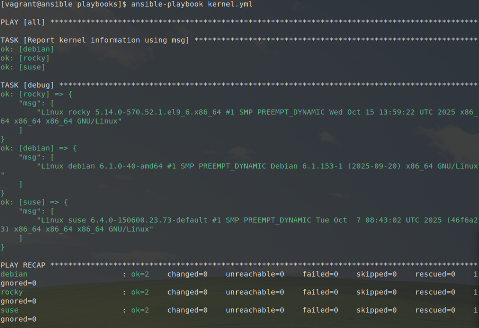
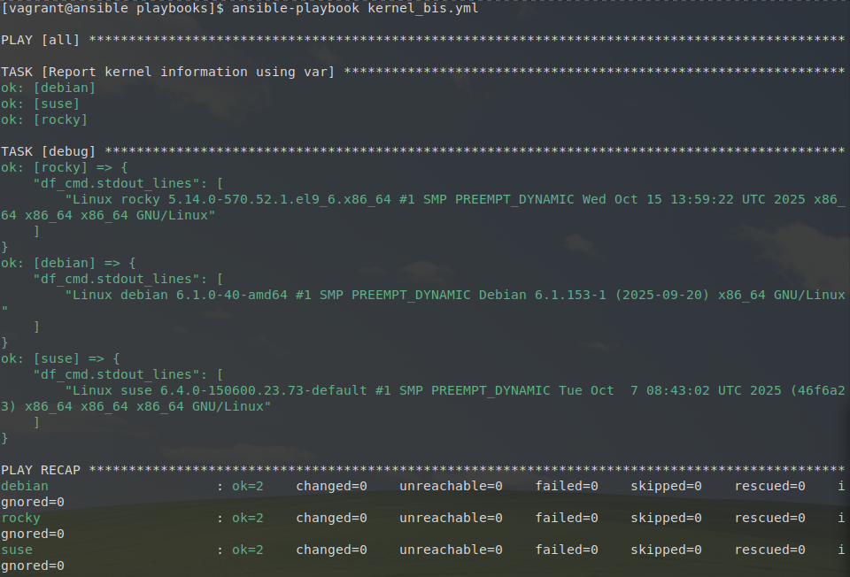
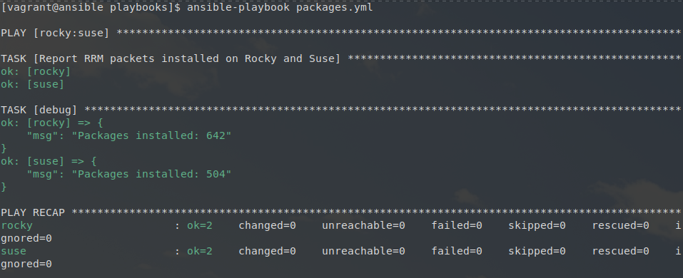

## Les variables enregistrées

### Étape 1

Écriture du playbook `kernel.yml` : 

```yaml
---  # kernel.yml

- hosts: all
  gather_facts: false

  tasks:

    - name: Report kernel information using msg
      command: uname -a
      changed_when: false
      register: df_cmd

    - debug:
        msg: "{{df_cmd.stdout_lines}}"

...
```

Affiche : 



### Étape 2

Utilisation du paramètre `var` du module `debug` pour essayer d'obtenir le même résutat que précédemment : 

```yaml
---  # kernel_bis.yml

- hosts: all
  gather_facts: false

  tasks:

    - name: Report kernel information using var
      command: uname -a
      changed_when: false
      register: df_cmd

    - debug:
        var: df_cmd.stdout_lines
...
```

Affiche : 



### Étape 3

Écriture du playbook `packages.yml` : 

```yaml
---  # packages.yml

- hosts: rocky:suse
  gather_facts: false

  tasks:

    - name: Report RRM packets installed on Rocky and Suse 
      shell: rpm -qa | wc -l
      changed_when: false
      register: df_cmd

    - debug:
        msg: "Packages installed: {{ df_cmd.stdout }}"

...
```

Affiche : 




