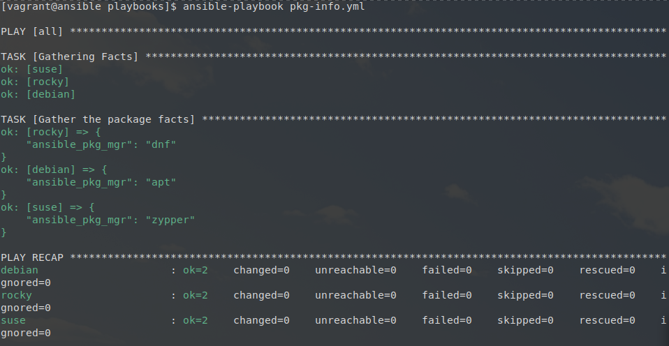
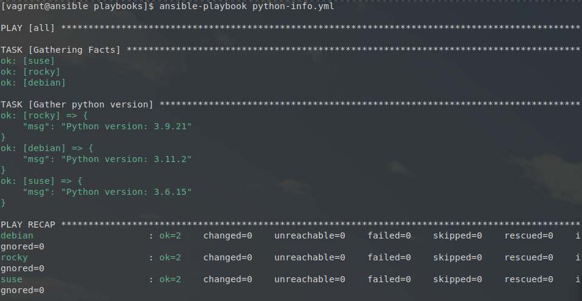
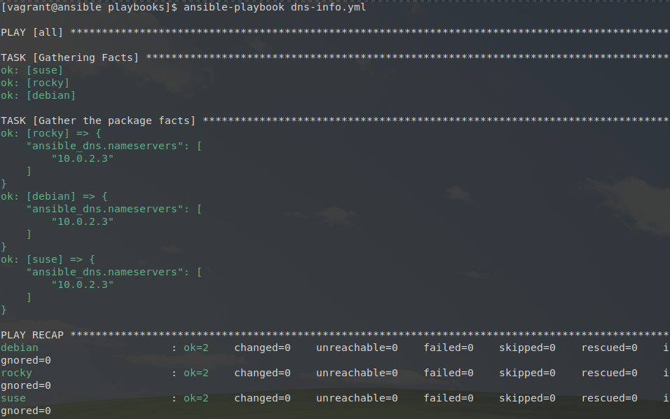

## Facts et variables implicites

### Étape 1

Écriture du playbook `pkg-info.yml` : 

```yaml
---  # pkg-info.yml

- hosts: all

  tasks:

    - name: Gather the package facts
      debug:
        var: ansible_pkg_mgr
...
```

Affiche :




### Étape 2

Écriture du playbook `python-info.yml` :

```yaml
---  # python-info.yml

- hosts: all

  tasks:

    - name: Gather python version
      debug: 
        msg: "Python version: {{ ansible_python_version }}"
...
```

Affiche : 




### Étape 3

Écriture du playbook `dns-info.yml` :

```yaml
---  # dns-info.yml

- hosts: all

  tasks:

    - name: Gather the package facts
      debug:
        var: ansible_dns.nameservers
...
```

Affiche : 


