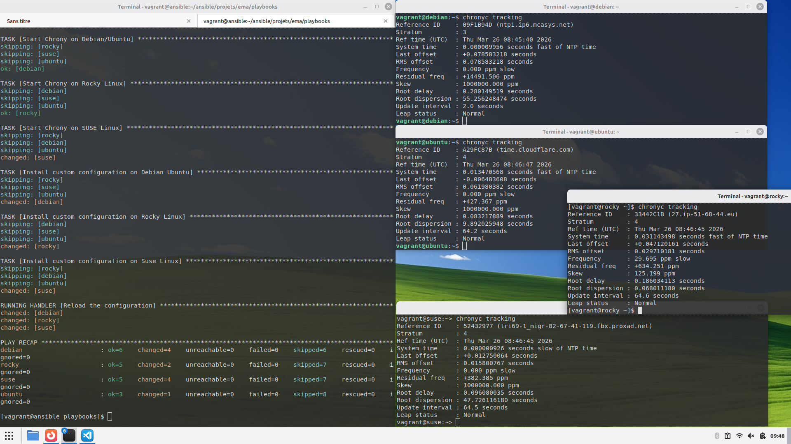
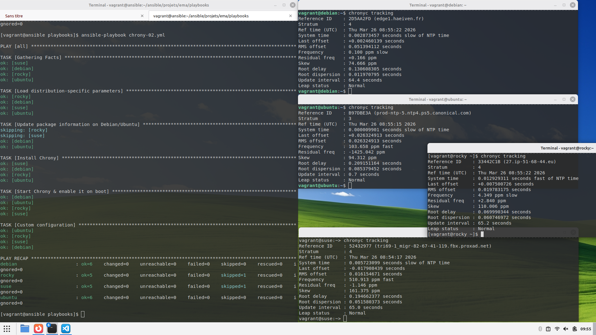

## Cibles hétérogènes

### Étape 1

Écriture du playbook `chrony-01.yml` avec la méthode des gros sabots : 

```yaml
---  # chrony-01.yml

- hosts: all

  tasks:

    - name: Update package information on Debian/Ubuntu
      apt:
        update_cache: true
        cache_valid_time: 3600
      when: ansible_os_family == "Debian"

    - name: Install Chrony on Debian/Ubuntu
      apt:
        name: chrony
      when: ansible_os_family == "Debian"

    - name: Install Chrony on Rocky Linux
      dnf:
        name: chrony
      when: ansible_distribution == "Rocky"

    - name: Install Chrony on SUSE Linux
      zypper:
        name: chrony
      when: ansible_distribution == "openSUSE Leap"

    - name: Start Chrony on Debian/Ubuntu
      service:
        name: chrony
        state: started
        enabled: true
      when: ansible_distribution == "Debian"

    - name: Start Chrony on Rocky Linux
      service:
        name: chronyd
        state: started
        enabled: true
      when: ansible_distribution == "Rocky"

    - name: Start Chrony on SUSE Linux
      service:
        name: chronyd
        state: started
        enabled: true
      when: ansible_distribution == "openSUSE Leap"

    - name: Install custom configuration on Debian Ubuntu
      copy:
        dest: /etc/chrony.conf
        mode: 0644
        content: |
          server 0.fr.pool.ntp.org iburst
          server 1.fr.pool.ntp.org iburst
          server 2.fr.pool.ntp.org iburst
          server 3.fr.pool.ntp.org iburst
          driftfile /var/lib/chrony/drift
          makestep 1.0 3
          rtcsync
          logdir /var/log/chrony
      when: ansible_distribution == "Debian"
      notify: Reload the configuration


    - name: Install custom configuration on Rocky Linux
      copy:
        dest: /etc/chrony.conf
        mode: 0644
        content: |
          server 0.fr.pool.ntp.org iburst
          server 1.fr.pool.ntp.org iburst
          server 2.fr.pool.ntp.org iburst
          server 3.fr.pool.ntp.org iburst
          driftfile /var/lib/chrony/drift
          makestep 1.0 3
          rtcsync
          logdir /var/log/chrony
      when: ansible_distribution == "Rocky"
      notify: Reload the configuration


    - name: Install custom configuration on Suse Linux
      copy:
        dest: /etc/chrony.conf
        mode: 0644
        content: |
          server 0.fr.pool.ntp.org iburst
          server 1.fr.pool.ntp.org iburst
          server 2.fr.pool.ntp.org iburst
          server 3.fr.pool.ntp.org iburst
          driftfile /var/lib/chrony/drift
          makestep 1.0 3
          rtcsync
          logdir /var/log/chrony
      when: ansible_distribution == "openSUSE Leap"
      notify: Reload the configuration

  handlers:
    - name: Reload the configuration
      service:
        name: chronyd
        state: restarted
...
```

Affiche : 




### Étape 2

Création des fichiers `vars` : 

Pour Debian : 

```yaml
---  # vars/chrony_debian.yml

chrony_package_name: chrony
chrony_service_name: chrony
chrony_confdir_path: /etc/chrony

...
```

Pour Ubuntu : 

```yaml
---  # vars/chrony_ubuntu.yml

chrony_package_name: chrony
chrony_service_name: chrony
chrony_confdir_path: /etc/chrony

...
```

Pour Rocky Linux : 

```yaml
---  # vars/chrony_rocky.yml

chrony_package_name: chrony
chrony_service_name: chronyd
chrony_confdir_path: /etc

...
```

Pour Open Suse : 

```yaml
---  # vars/chrony_opensuse-leap.yml

chrony_package_name: chrony
chrony_service_name: chronyd
chrony_confdir_path: /etc

...
```

Écriture du playbook `chrony-02.yml` : 

```yaml
---  # chrony-02.yml

- hosts: all

  tasks:

    - name: Load distribution-specific parameters
      include_vars: >
        chrony_{{ansible_distribution|lower|replace(" ", "-") }}.yml

    - name: Update package information on Debian/Ubuntu
      apt:
        update_cache: true
        cache_valid_time: 3600
      when: ansible_os_family == "Debian"

    - name: Install Chrony
      package:
        name: "{{chrony_package_name}}"

    - name: Start Chrony & enable it on boot
      service:
        name: "{{chrony_service_name}}"
        state: started
        enabled: true

    - name: Custom configuration
      copy:
        dest: "{{chrony_confdir_path}}/chrony.conf"
        mode: 0644
        content: |
          server 0.fr.pool.ntp.org iburst
          server 1.fr.pool.ntp.org iburst
          server 2.fr.pool.ntp.org iburst
          server 3.fr.pool.ntp.org iburst
          driftfile /var/lib/chrony/drift
          makestep 1.0 3
          rtcsync
          logdir /var/log/chrony
      notify: Reload Chrony

  handlers:

    - name: Reload Chrony
      service:
        name: "{{chrony_service_name}}"
        state: restarted

...
```

Affiche : 



