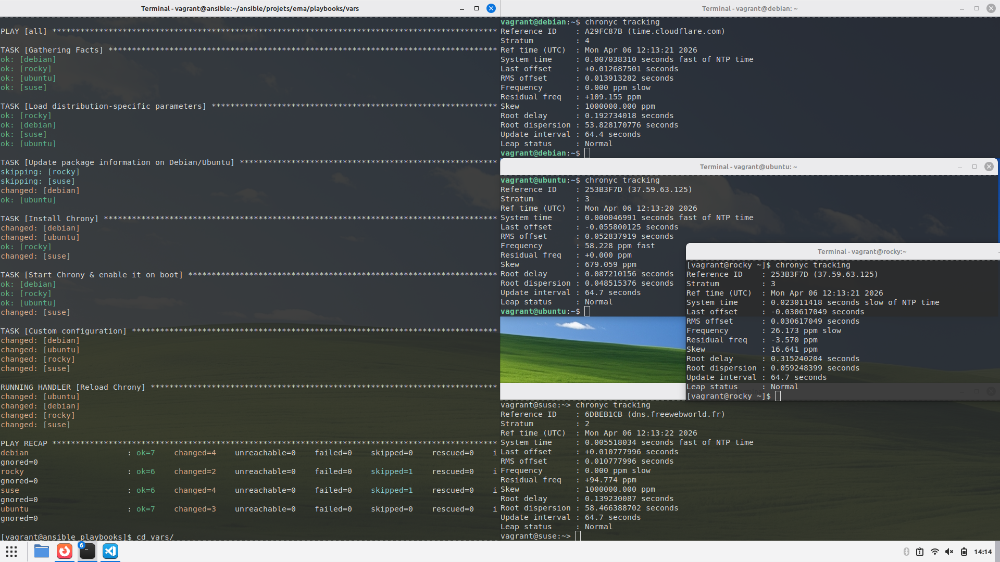

## Jinja & Templates

### Étape 1

Création du fichier allant être utilisé comme template : 

```console
$ cat templates/chrony.conf.j2

{# templates/chrony.conf.j2 #}

# {{ chrony_confdir_path }}/chrony.conf

server 0.fr.pool.ntp.org iburst
server 1.fr.pool.ntp.org iburst
server 2.fr.pool.ntp.org iburst
server 3.fr.pool.ntp.org iburst
driftfile /var/lib/chrony/drift
makestep 1.0 3
rtcsync
logdir /var/log/chrony
```

### Étape 2

Création des fichiers `vars` : 

Pour Debian : 

```yaml
---  # vars/chrony_debian.yml

chrony_package_name: chrony
chrony_service_name: chrony
chrony_confdir_path: /etc/chrony

...
```

Pour Ubuntu : 

```yaml
---  # vars/chrony_ubuntu.yml

chrony_package_name: chrony
chrony_service_name: chrony
chrony_confdir_path: /etc/chrony

...
```

Pour Rocky Linux : 

```yaml
---  # vars/chrony_rocky.yml

chrony_package_name: chrony
chrony_service_name: chronyd
chrony_confdir_path: /etc

...
```

Pour Open Suse : 

```yaml
---  # vars/chrony_opensuse-leap.yml

chrony_package_name: chrony
chrony_service_name: chronyd
chrony_confdir_path: /etc

...
```

### Étape 3

Écriture du playbook `chrony.yml` qui installe un fichier de configuration personnalisé sur les cibles : 

```yaml
---  # chrony.yml

- hosts: all

  tasks:

    - name: Load distribution-specific parameters
      include_vars: >
        chrony_{{ansible_distribution|lower|replace(" ", "-") }}.yml

    - name: Update package information on Debian/Ubuntu
      apt:
        update_cache: true
        cache_valid_time: 3600
      when: ansible_os_family == "Debian"

    - name: Install Chrony
      package:
        name: "{{chrony_package_name}}"

    - name: Start Chrony & enable it on boot
      service:
        name: "{{chrony_service_name}}"
        state: started
        enabled: true

    - name: Custom configuration
      template:
        dest: "{{chrony_confdir_path}}/chrony.conf"
        mode: 0644
        src: chrony.conf.j2
      notify: Reload Chrony

  handlers:

    - name: Reload Chrony
      service:
        name: "{{chrony_service_name}}"
        state: restarted

...
```

Affiche : 

